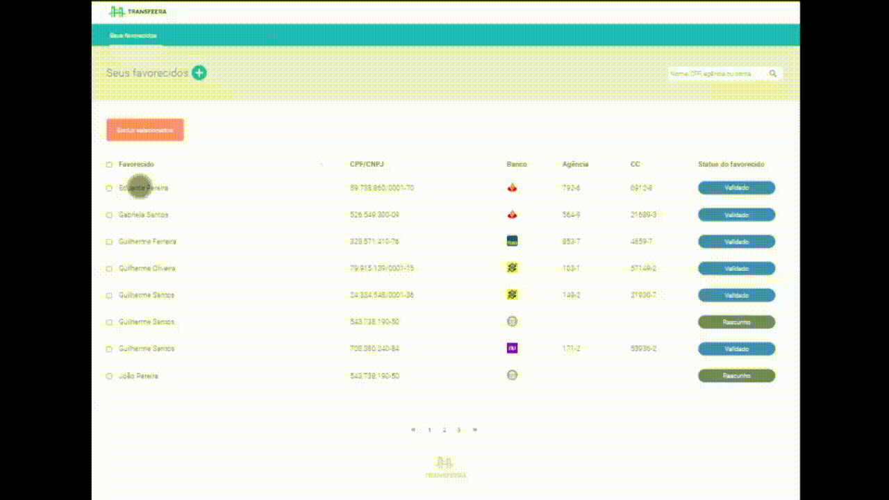

# Transfeera - Tech Challenge - Abda Pereira

Esta é uma aplicação para gerenciamento de favorecidos usando operações CRUD para o registro de dados pessoais, bancários e chave PIX.

## Demonstração



## Stack utilizada

**Front-end:** React, React Icons, Styled Components, SCSS

**Back-end:** Node, Json Server

**Teste automatizados:** Cypress

## Instalação

#### 1) Clone o repositório:
```bash
git clone https://github.com/abda-pereira/transfeera-tech-challenge.git
```

#### 2) Navegue para a pasta do projeto
```bash
cd transfeera-tech-challenge
```

#### 3) Instale as dependências:
```bash
npm install
```

## Executando o Projeto

Siga as etapas abaixo para executar o projeto localmente.

#### 1) Inicie o JSON Server:
```bash
npm run server
```

#### 2) Inicie o aplicativo React:
```bash
npm run dev
```

#### 3) Execute os testes com Cypress:
```bash
npm run cy:open
```
##

From **[Abda Pereira](https://abda-pereira.netlify.app/)**

